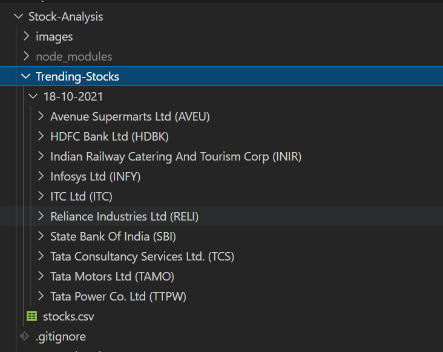
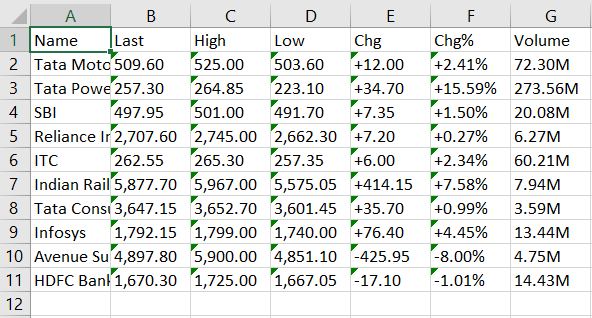
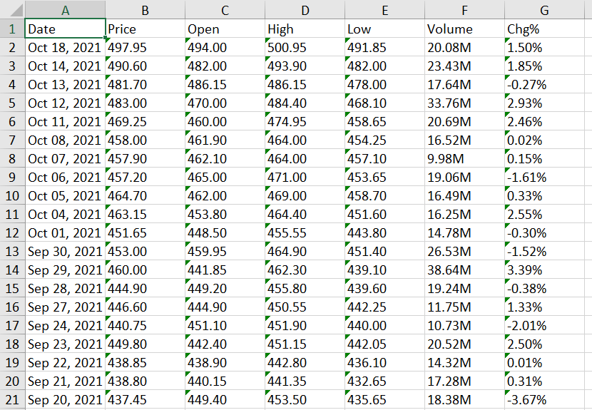
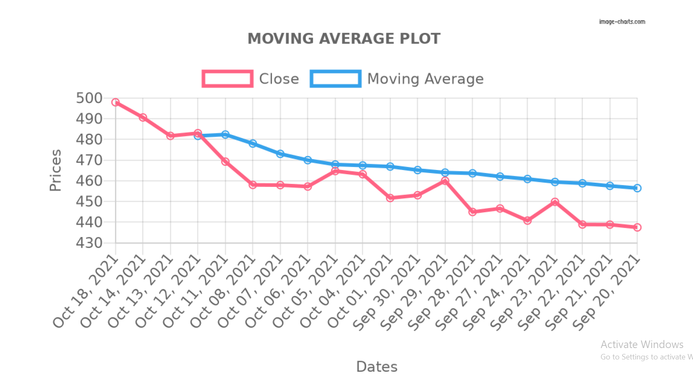
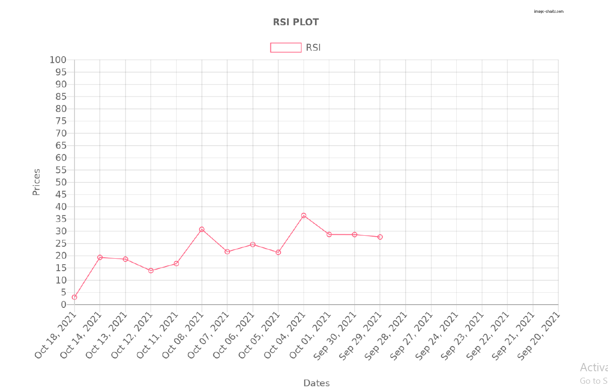
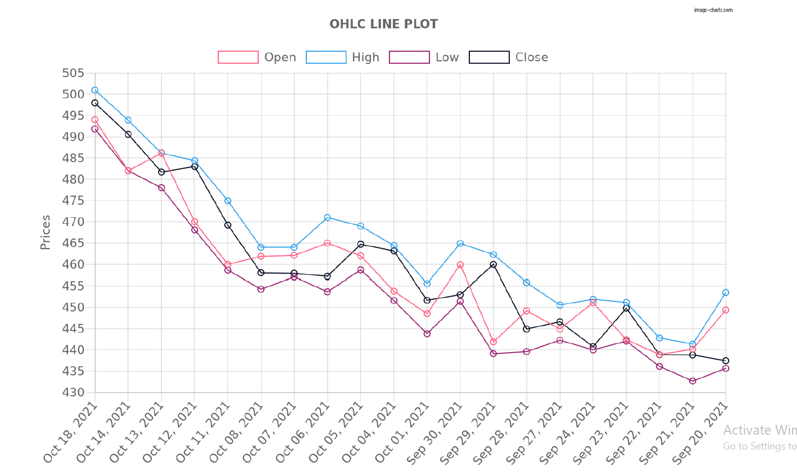

<div id="top"></div>
<!--
*** Thanks for checking out this activity. If you have any suggestion of open source collab ideas.
*** let me know in my email.
-->

<!-- PROJECT LOGO -->
<br />
<div align="center">
  <a href="https://github.com/dcodeforyou/StockAnalysis">
    
  </a>

<h3 align="center">Web-Scraping: NSE Stock Analysis</h3>

  <p align="center">
    Top 10 trending NSE stocks data analysis using web scraping.
    <br />
    <a href="https://github.com/dcodeforyou/StockAnalysis"><strong>Docs »</strong></a>
    <br />
  </p>
</div>


<!-- TABLE OF CONTENTS -->
<details>
  <summary>Table of Contents</summary>
  <ol>
    <li>
      <a href="#about-the-project">About The Project</a>
      <ul>
        <li><a href="#built-with">Built With</a></li>
      </ul>
    </li>
    <li>
      <a href="#getting-started">Getting Started</a>
      <ul>
        <li><a href="#prerequisites">Prerequisites</a></li>
        <li><a href="#installation">Installation</a></li>
      </ul>
    </li>
    <li><a href="#usage-results">Usage Results</a></li>
    <li>
      <a href="#roadmap">Roadmap</a>
      <ul>
        <li><a href="#scraped-stocks-data">Scraped Stocks Data</a></li>
        <li><a href="#created-excel">Created Excel</a></li>
        <li><a href="#calculations">Calculations</a></li>
        <li><a href="#created-pdf-plots">Created PDF Plots</a></li>
      </ul>
    </li>
    <li><a href="#extra-things-to-try">Extra Things to Try</a></li>
    <li><a href="#contact">Contact</a></li>
  </ol>
</details>


<!-- ABOUT THE PROJECT -->
## About The Project


Hello There!

The intention of this activity was to learn web scraping via Javascript.

In this activity I have created a script for scraping top 10 NSE stocks. Create a csv for all stocks and seperate csv for each stock as well as SMA, RSI and OHLC line plot for each stock. 

<p align="right">(<a href="#top">back to top</a>)</p>


## Built With

<a href="https://nodejs.org/en/">
    
</a>
&nbsp;
&nbsp;
<a href="https://www.javascript.com/">
    
</a>

<p align="right">(<a href="#top">back to top</a>)</p>


<!-- GETTING STARTED -->
## Getting Started

To setup this activity locally, you just need to clone this repository and follow these simple <a href="#installation">installation</a> steps. 

### Prerequisites

You need to have [Node](https://www.nodejs.org/) and [npm](https://www.npmjs.com/) installed on your machine.

### Installation

1. Clone the repo with - 
   ```sh
   git clone https://github.com/dcodeforyou/StockAnalysis
   ```
2. Inside the project root directory install NPM packages with -
   ```sh
   npm install
   ```

3. To run the script - 
    ```js
      node main.js
    ```

<p align="right">(<a href="#top">back to top</a>)</p>


<!-- USAGE EXAMPLES -->
## Usage Results

The result of this activity can be tested with generated CSVs and Pdf Plots.

  

 

 

 

 

 

<p align="right">(<a href="#top">back to top</a>)</p>


<!-- ROADMAP -->
## Roadmap

  ## Scraped stocks Data
  - [x] Scraped top 10 NSE stocks from [in.investin.com](https://in.investing.com/) via making request with axios and scrapped data using jsdom. Then for every stocks in the list scrapped their historical data.
    
  ## Created Excel
  - [x] Using the scraped data created a csv for all stocks using exceljs and seperate csv with historical data for each stock inside the respective stock name folder grouped by date using excel4node.

  ## Calculations
  - [x] Using scrapped data calculated Simple Moving Average (SMA) and RSI.

  ## Created PDF Plots
  - [x] Using calculations generated SMA and RSI plot. Also, with historical data generated OHLC line plot. Plots are generated using chartjs-image and saved as pdfs using pdf-lib.
  
  > Stock with RSI ≥70 is often considered overbought, while with RSI ≤ 30 is often considered oversold. So an overbought signal suggests that assets may be in for a price correction and oversold signal could mean that short-term declines are reaching maturity and assets may be in for a rally.

<p align="right">(<a href="#top">back to top</a>)</p>


<!-- CONTACT -->
## Contact

For any suggestion or any open source contribution or any query. You can find me here &#8595;
Dushyant Surya - dcodeforyou@gmail.com

Activity Link: [https://github.com/dcodeforyou/StockAnalysis](https://github.com/dcodeforyou/StockAnalysis)

<p align="right">(<a href="#top">back to top</a>)</p>

